<div align="center">

# 💫 Yonatan Valencia

**Sr. Software & AI Integration Engineer @ Globant**

*Designing scalable architectures, agentic AI workflows, and self-hosted ecosystems.*

[](https://discord.gg/yvalenta#8336)
[](https://linkedin.com/in/yvalenta)
[](https://twitter.com/yvalenciat)
[](https://instagram.com/valencia_ynt)

</div>

---

## 🔭 About Me

With over a decade of experience in the **Ruby on Rails** ecosystem and backend engineering, I currently specialize in the convergence of traditional software engineering and **Artificial Intelligence**. 

I build agentic workflows (leveraging LangChain and Anthropic Claude) and design robust DevOps infrastructures. When I'm not optimizing Docker containers or integrating complex APIs, I enjoy structured swim training and exploring the intersection of technology and brand development within the hospitality and gastronomy sector.

---

## 🌌 Skills & Projects Constellation

<div align="center">
  
  <br>
  <p><i>An interconnected view of my tech stack, projects, and areas of expertise.</i></p>
</div>

---

## 💻 Tech Stack

<div align="center">

### ⚡ Core & Frameworks


### 🧠 AI & Agentic Workflows


### ☁️ Cloud, Infra & Data


</div>

---

## 🏠 Home Lab: AI-Assisted Infrastructure

> A personal learning environment where I explore infrastructure, networking, and container orchestration end-to-end. Everything is designed, debugged, and documented with AI assistance.

<div align="center">
  
</div>

### 🏗️ Architecture Breakdown

| Layer | Tool | Primary Function |
| :--- | :--- | :--- |
| **Tunnel** | Cloudflare Tunnels + `cloudflared` | Secure public exposure — zero open ports (Zero Trust). |
| **Reverse proxy** | nginx-proxy-manager | Hostname routing to containers and TLS certificate management. |
| **Containers** | Docker + Portainer | Execution, isolation, and management of all services. |
| **Monitoring** | Netdata | Real-time telemetry (CPU, memory, SSH sessions, Nginx traffic). |

### 🔍 Key Engineering Learnings
* Deploying persistent outbound tunnels with `cloudflared` to bypass **CGNAT** restrictions, drastically improving security by eliminating the need for open ports.
* Architecting internal **Docker** networking to enable container-to-container communication via isolated service names.
* Implementing `Host` header routing with **Nginx Proxy Manager**, allowing multiple independent applications to run efficiently on a single base host (Ubuntu Server).

---

## 🤖 The AI Integration Ecosystem

Beyond the Home Lab, Artificial Intelligence is the core of my professional workflow, acting not as a replacement, but as an engineering accelerator.

```text
  ┌─────────────────────────────────────────────────────┐
  │              AI Integration Stack                   │
  │                                                     │
  │  LangChain ────────► Agent Orchestration            │
  │  Anthropic Claude ─► Reasoning & Generation         │
  │  Amazon Bedrock ───► Multi-model API Gateway        │
  │  RAG Pipelines ────► Embeddings + Vector Search     │
  └─────────────────────────────────────────────────────┘