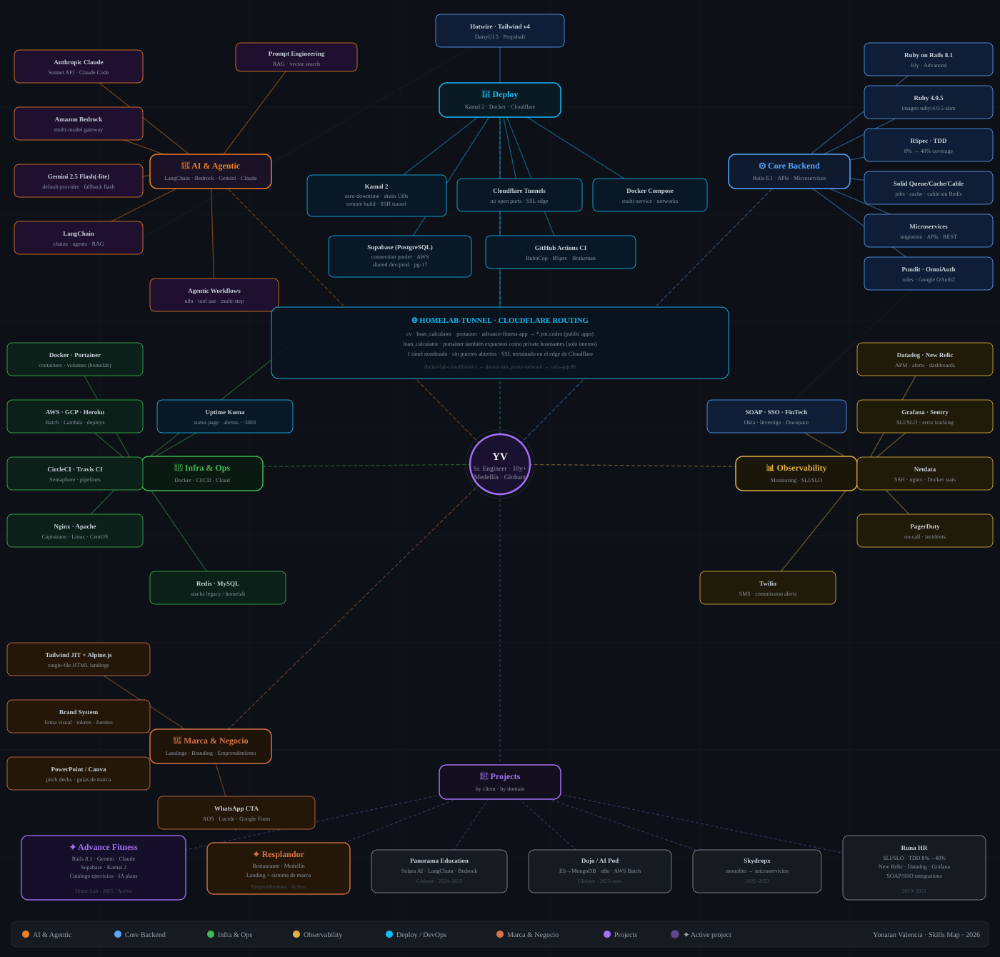
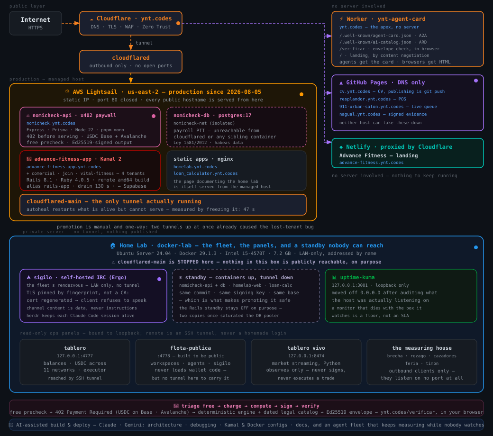

<div align="center">

# 💫 Yonatan Valencia

**Sr. Software & AI Integration Engineer @ Globant**

*Designing scalable architectures, agentic AI workflows, and self-hosted ecosystems.*

[](https://discord.gg/yvalenta#8336)
[](https://linkedin.com/in/yvalenta)
[](https://twitter.com/yvalenciat)
[](https://instagram.com/valencia_ynt)

</div>

---

## 🔭 About Me

With over a decade of experience in the **Ruby on Rails** ecosystem and backend engineering, I currently specialize in the convergence of traditional software engineering and **Artificial Intelligence**.

I build agentic workflows (LangChain, n8n, Anthropic Claude, Gemini, Amazon Bedrock) and design robust DevOps infrastructures — from zero-downtime **Kamal 2** deploys to a fully self-hosted **home lab** exposed through a single Cloudflare Tunnel with no open ports. Lately my main line of work is **verifiable compute**: outputs that a third party can check without trusting whoever produced them — see [NomiCheck](#-nomicheck--verifiable-payroll) below.

When I'm not optimizing containers or integrating APIs, I enjoy structured swim training and exploring the intersection of technology and brand development within the hospitality and gastronomy sector — currently building the digital presence and point-of-sale system for **Resplandor**, a Colombian restaurant in La Estrella, Antioquia.

---

## 🌌 Skills & Projects Constellation

<div align="center">
  
  <br>
  <p><i>An interconnected view of my tech stack, projects, and areas of expertise.</i></p>
</div>

---

## 💻 Tech Stack

<div align="center">

### ⚡ Core & Frameworks


### 🎨 Frontend & Design Systems


### 🧠 AI & Agentic Workflows


### 🔏 Verifiable Compute


### ☁️ Cloud, Infra & Data


</div>

---

## ⚖️ NomiCheck — verifiable payroll

> **The calculation is a commodity. The proof is not.**

A Colombian payroll engine built around one idea: an answer nobody can check is worth
very little. Live at **[nomicheck.ynt.codes](https://nomicheck.ynt.codes)**.

| Piece | What it does |
| :--- | :--- |
| **Dated legal catalog** | Every statutory parameter — minimum wage, transport allowance, UVT, night and Sunday premiums, the ordinary-hour divisor, social-security rates, garnishment and withholding caps — resolvable on **any** date since 2020, each with the decree or resolution that set it and the window it was in force. |
| **Deterministic calculators** | Payroll, withholding tax, payslip verification, final settlement, USDC payout. Every response cites its legal basis (CST, E.T. art. 383/388) and carries the `sha256` of the catalog that produced it. |
| **Signed envelopes** | Each output is signed **Ed25519**. Anyone can verify it at [`ynt.codes/verificar`](https://ynt.codes/verificar) — the page runs entirely in the browser and sends nothing to any server, so verification never depends on trusting the issuer. |
| **x402 paywall** | The priced endpoints answer `402 Payment Required` before doing any work, and settle in **USDC on Base** (EIP-3009). Charge first, then serve — a wall that serves before it collects is not a wall. |
| **Agent identity** | An **ERC-8004** identity on Base mainnet, published as an A2A **agent card** and an **ARD catalog** at [`ynt.codes`](https://ynt.codes), with **ERC-8128** request signing against Execution Market. |
| **Stateless by design** | Input JSON is processed in memory and discarded — never written to a database (Ley 1581/2012, *habeas data*). |

Verify one end-to-end, in one click, with nothing installed and no account:

```
https://ynt.codes/verificar?url=https://nomicheck.ynt.codes/api/batch/verificar/ejemplo
```

**Stack:** TypeScript · Express · Prisma · PostgreSQL 17 · React 19 + Vite · pnpm monorepo · viem · Docker Compose on the home lab. The API and the web ship as **one container on one port**, and `/api/health` publishes the exact commit it is running.

---

## 🏠 Home Lab: AI-Assisted Infrastructure

> A single-node personal environment where I explore infrastructure, networking, and container orchestration end-to-end. Everything is designed, debugged, and documented with AI assistance.

<div align="center">
  
</div>

### 🏗️ Architecture Breakdown

| Layer | Tool | Primary Function |
| :--- | :--- | :--- |
| **Tunnel** | Cloudflare Tunnel (`homelab-tunnel`) + `cloudflared` | Secure public exposure — zero open ports (Zero Trust). One named tunnel routes every self-hosted subdomain. |
| **Edge** | Cloudflare Workers | Serves the apex (`ynt.codes`) and the CV with **no server involved** — agent card, ARD catalog and the envelope verifier are embedded in the Worker itself. |
| **Reverse proxy** | Docker network aliases (`docker-lab_proxy-network`) + nginx | Hostname routing to containers; TLS terminates at the Cloudflare edge. |
| **Containers** | Docker Compose · Docker 29.6.1 on Ubuntu 25.04 | Execution and isolation of every service on one box (Intel i5-4570T · 7.2 GB). |
| **Deploy** | Kamal 2 + Thruster (Rails) · `deploy.sh` + Compose (NomiCheck) | Zero-downtime deploys, remote `amd64` builds over SSH, extended drain window for long-running AI jobs. |
| **Database** | Supabase (PostgreSQL 17) · local `postgres:17` | Managed Postgres via AWS pooler for the Rails side; NomiCheck's own Postgres sits on a **private network unreachable from the tunnel**, because it holds payroll PII. |
| **Monitoring** | Netdata + Uptime Kuma | Real-time telemetry (CPU, memory, SSH sessions, nginx traffic, Docker stats) and uptime checks. Uptime Kuma is bound to **loopback**, not to `0.0.0.0` — it has no public hostname. |

### 🌐 Published on `ynt.codes`

Eleven hostnames, three different ways in. Verified live:

| Host | How it gets there | What it serves |
| :--- | :--- | :--- |
| [`ynt.codes`](https://ynt.codes) | Cloudflare Worker | A2A agent card, ARD catalog, envelope verifier |
| [`nomicheck.ynt.codes`](https://nomicheck.ynt.codes) | Tunnel | **NomiCheck** — *Tu nómina, verificada* |
| [`cv.ynt.codes`](https://cv.ynt.codes) | Cloudflare Worker | CV / portfolio |
| [`homelab.ynt.codes`](https://homelab.ynt.codes) | Tunnel | *Ynt-labs · Homelab Architecture* — this lab, documented live |
| [`advance-fitness-app.ynt.codes`](https://advance-fitness-app.ynt.codes) | Tunnel | Advance Fitness — gym platform (login) |
| [`comercial.ynt.codes`](https://comercial.ynt.codes) | Tunnel | Advance Fitness — tenant (login) |
| [`join.ynt.codes`](https://join.ynt.codes) | Tunnel | Advance Fitness — tenant (login) |
| [`vital-fitness.ynt.codes`](https://vital-fitness.ynt.codes) | Tunnel | Advance Fitness — tenant *Vital fitness* (login) |
| [`advance-fitness.ynt.codes`](https://advance-fitness.ynt.codes) | CNAME → Netlify | Advance Fitness — landing page |
| [`loan_calculator.ynt.codes`](https://loan_calculator.ynt.codes) | Tunnel | *Simulador de Abonos a Capital* |
| [`resplandor.ynt.codes`](https://resplandor.ynt.codes) | CNAME → GitHub Pages | *Resplandor — POS* |
| [`911-urban-salon.ynt.codes`](https://911-urban-salon.ynt.codes) | CNAME → GitHub Pages | *911 Urban Salón* — barbershop site + live queue panel |

### 🔍 Key Engineering Learnings
* Deploying a single persistent outbound tunnel with `cloudflared` to bypass **CGNAT** restrictions, eliminating the need for any open port on the home network.
* Architecting internal **Docker** networking so a freshly deployed Kamal container re-joins the right `network-alias` inside the proxy network without manual intervention.
* Tuning **Kamal's `drain_timeout`** well above the default so in-flight AI plan generations (up to ~120s) survive a mid-generation deploy instead of leaving jobs stuck.
* Running dev and prod against the **same external Postgres instance** safely, with clear guardrails around `DATABASE_URL` vs `DEV_DATABASE_URL`.
* Putting the payroll database on its **own isolated Docker network**, so `cloudflared` cannot reach it even if a routing rule is written by mistake — and moving Uptime Kuma off `0.0.0.0` after auditing what the host was actually listening on.
* Making the deploy **measure what it served** rather than what it intended: exporting a variable is not the same as delivering it to the container, and a deploy that silently didn't looks exactly like one that did.

---

## 🤖 The AI Integration Ecosystem

Beyond the Home Lab, Artificial Intelligence is the core of my professional workflow, acting not as a replacement, but as an engineering accelerator.

```text
  ┌─────────────────────────────────────────────────────┐
  │              AI Integration Stack                   │
  │                                                     │
  │  LangChain ────────► Agent Orchestration            │
  │  Anthropic Claude ─► Reasoning & Generation         │
  │  Gemini 2.5 Flash ─► Primary provider (multi-model) │
  │  Amazon Bedrock ───► Multi-model API Gateway        │
  │  RAG Pipelines ────► Embeddings + Vector Search     │
  │  n8n ──────────────► Multi-step Agentic Workflows   │
  └─────────────────────────────────────────────────────┘
```

**Advance Fitness** is the flagship application of this stack: a multi-tenant gym management platform (Rails 8.1 · Ruby 4.0.5) with AI-generated, editable training and nutrition plans through a provider adapter layer — `gemini-2.5-flash` by default, `claude-sonnet-5` as fallback — deployed via Kamal 2 on the home lab and backed by Supabase. Four tenants run off the same deployment, each on its own hostname.

---

## 🎨 Brand & Business

Alongside engineering, I design and build the digital presence — and increasingly the operational software — for small hospitality and e-commerce brands.

| Project | Description |
| :--- | :--- |
| **[Resplandor](https://resplandor.ynt.codes)** | Colombian restaurant & bar in La Estrella, Antioquia. Full brand system and landing page, plus a working **point-of-sale**: table map, orders, split billing, pre-checks and end-of-day close. |
| **[911 Urban Salón](https://911-urban-salon.ynt.codes)** | Barbershop, spa & massage studio in El Poblado, Medellín. Graffiti-brand landing with a multi-service booking assistant, plus a **live operations panel** (`/admin`): shared realtime queue, per-barber logins with role-based views, attention confirmation with POS-style checkout, product sales and daily cash summary — Supabase (Postgres RLS + Realtime + Storage), content edited from the panel and published straight to the page. |
| **FungiLab** | Functional mushroom supplement brand — product-focused landing with animated visual components. |

**Stack:** single-file HTML · Tailwind CSS (JIT via CDN) or design-system tokens with custom brand palettes · Alpine.js / React via CDN · Lucide Icons · AOS scroll animations · Google Fonts · Supabase for the POS and the salon queue.
